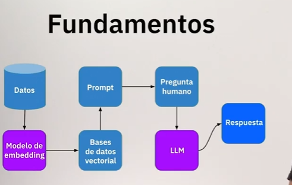
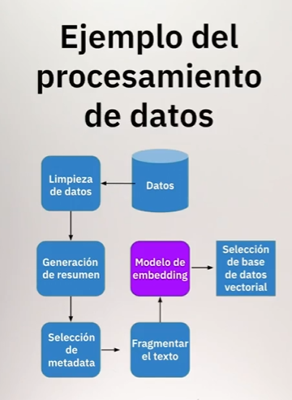
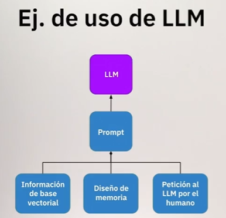
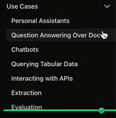

Es opensource, permite crear aplicaciones LLM

Lo integramos con bases de datos vectoriales para crear indices.

Y esos indices nos permiten encontrar las respuestas que quiere el cliente

Pregunta -> Modelo de embeddings vectorial -> Modelo 2 crea resumen -> Modelo 3 Resolver la pregunta -> Respuesta

Se puede usar con Python y JS

Estructura
    - Conexión con modelos
    - Conexión con datos
    - Encadenamiento de procesos

https://github.com/langchain-ai/langchain

https://docs.langchain.com/

https://docs.langchain.com/oss/python/integrations/providers/overview

Langchain permite usar información nueva para conectarla a un llm y obtener respuestas desde información que no tenía.

Sí hablamos de modelos de chat, tiene integrados 6: 2 de OpenAI, Jina, Anthropic, Azure, PaLM (de Google), VertexAI y MLflow, pero también tiene integración con más de 50 modelos LLM's.

Langchain nos permite cargar modelos con las mismas lineas.

